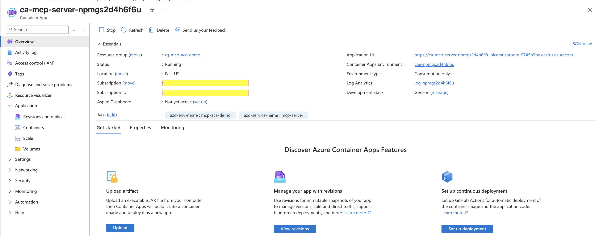
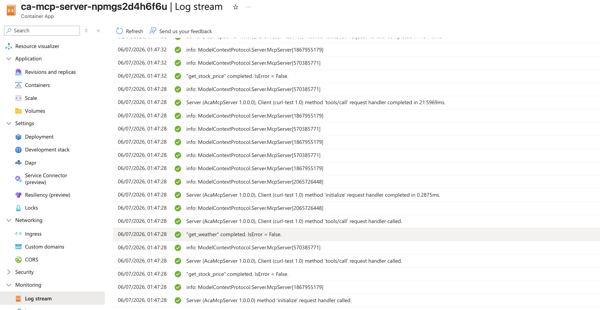

# Deploying an MCP server to Azure Container Apps with the Microsoft Agent Framework

In the last few blogs I built agents. They were great — until they lived on my laptop. Real agents need tools that live somewhere the whole team can reach. The clean shape for that today is: put your tools behind an **MCP server**, put the server in **Azure Container Apps**, and let any agent — Copilot, Claude, or your own — pick it up over HTTPS. This post shows the whole path in ~30 minutes.

Full code: [github.com/sainiteshGit/sample-ai-project → mcp-aca-agentframework](https://github.com/sainiteshGit/sample-ai-project/tree/master/mcp-aca-agentframework)

## Step 1 : Why Azure Container Apps for an MCP server?

An MCP server is an ordinary HTTP service that speaks a small JSON-RPC dialect. It doesn’t need a cluster, doesn’t need a load balancer, doesn’t need a VM. Azure Container Apps is exactly that shape:

- **Serverless containers.** You hand it a container image, it runs it. No Kubernetes to babysit ([Microsoft Learn](https://learn.microsoft.com/en-us/azure/container-apps/overview)).
- **Scale-to-zero.** When no agent is talking to your MCP server, you pay nothing. Cold start is ~15–25s; warm calls are ~50ms.
- **HTTPS ingress out of the box** with a real cert on `*.<env>.<region>.azurecontainerapps.io`. MCP clients hate self-signed.
- **Built-in log analytics + revisions** for zero-downtime deploys and A/B rollout of new tools.

That checks every box for an MCP server. The next steps build one and put it there.

## Step 2 : The MCP server

Two files. That’s it.

[`Server/AcaMcpServer.csproj`](../mcp-aca-agentframework/Server/AcaMcpServer.csproj) — one package reference:

```xml
<PackageReference Include="ModelContextProtocol.AspNetCore" Version="1.3.0" />
```

[`Server/Program.cs`](../mcp-aca-agentframework/Server/Program.cs):

```csharp
var builder = WebApplication.CreateBuilder(args);

builder.Services
    .AddMcpServer()
    .WithHttpTransport()            // MCP over Streamable HTTP — required for cloud.
    .WithTools<WeatherTools>()
    .WithTools<StockTools>();

// ACA sends traffic to $PORT (defaults to 8080).
var port = Environment.GetEnvironmentVariable("PORT") ?? "8080";
builder.WebHost.UseUrls($"http://0.0.0.0:{port}");

var app = builder.Build();
app.MapGet("/", () => Results.Ok(new { status = "ok" }));   // health probe
app.MapMcp("/mcp");                                          // the MCP endpoint
app.Run();
```

Tools are just methods with an attribute — see [`Server/Tools/WeatherTools.cs`](../mcp-aca-agentframework/Server/Tools/WeatherTools.cs):

```csharp
[McpServerToolType]
public sealed class WeatherTools
{
    [McpServerTool, Description("Get a short weather summary for a city.")]
    public static string GetWeather(
        [Description("City name, e.g. 'Seattle'")] string city) =>
        /* dummy lookup */ ...;
}
```

Two things worth calling out:
1. **HTTP transport, not stdio.** stdio is fine for local Claude Desktop; it can’t survive a network hop. `WithHttpTransport()` is the switch that makes this shippable.
2. **The `$PORT` env var.** ACA injects it. Honor it or your container is a black hole.

## Step 3 : Dockerize

Standard two-stage Dockerfile ([`Server/Dockerfile`](../mcp-aca-agentframework/Server/Dockerfile)):

```dockerfile
FROM mcr.microsoft.com/dotnet/sdk:8.0 AS build
WORKDIR /src
COPY AcaMcpServer.csproj ./
RUN dotnet restore
COPY . .
RUN dotnet publish -c Release -o /app/publish --no-restore

FROM mcr.microsoft.com/dotnet/aspnet:8.0 AS runtime
WORKDIR /app
COPY --from=build /app/publish ./
ENV ASPNETCORE_URLS=http://+:8080
EXPOSE 8080
ENTRYPOINT ["dotnet", "AcaMcpServer.dll"]
```

No Docker Desktop? Fine — the next step will remote-build in Azure Container Registry.

## Step 4 : Deploy with `azd up`

Two files describe the whole infra:

- [`azure.yaml`](../mcp-aca-agentframework/azure.yaml) — tells `azd` which folder to build and where the Container App lives.
- [`infra/resources.bicep`](../mcp-aca-agentframework/infra/resources.bicep) — Log Analytics + Managed Identity + ACR + Container Apps Environment + one Container App with `minReplicas: 0`, `maxReplicas: 3`, external HTTPS ingress on port 8080.

The important switch in `azure.yaml` — remote-build in ACR instead of local Docker:

```yaml
services:
  mcp-server:
    project: ./Server
    language: dotnet
    host: containerapp
    docker:
      path: Dockerfile
      remoteBuild: true      # <-- no local Docker needed
```

Then, from the project folder:

```bash
azd auth login
azd env new mcp-aca-demo --location eastus --subscription <sub-id>
azd up
```

Output on my run:

```
(✓) Done: Resource group: rg-mcp-aca-demo (717ms)
(✓) Done: Container Registry: acrnpmgs2d4h6f6u (7.4s)
(✓) Done: Log Analytics workspace: log-npmgs2d4h6f6u (21s)
(✓) Done: Container Apps Environment: cae-npmgs2d4h6f6u (57s)
(✓) Done: Container App: ca-mcp-server-npmgs2d4h6f6u (16s)
(✓) Done: Deploying service mcp-server
- Endpoint: https://ca-mcp-server-npmgs2d4h6f6u.<env>.eastus.azurecontainerapps.io/

SUCCESS: Your up workflow to provision and deploy to Azure completed in 1 minute 52 seconds.
```

_Screenshot placeholder — Azure Portal → your Container App → Overview showing the FQDN and “Running” status._



## Step 5 : An agent calls it

The whole point. [`Agent/Program.cs`](../mcp-aca-agentframework/Agent/Program.cs) uses the **Microsoft Agent Framework** (`Microsoft.Agents.AI` 1.13.0) with Azure OpenAI. Three moves:

```csharp
// 1) Connect to the MCP server over HTTP.
var transport = new HttpClientTransport(new HttpClientTransportOptions {
    Endpoint = new Uri(mcpServerUrl)
});
await using var mcpClient = await McpClient.CreateAsync(transport);

// 2) Discover its tools.
var mcpTools = await mcpClient.ListToolsAsync();

// 3) Give them to an Azure OpenAI agent as ordinary AITools.
AIAgent agent = new AzureOpenAIClient(new Uri(endpoint), new ApiKeyCredential(apiKey))
    .GetChatClient(deploymentName).AsIChatClient()
    .AsAIAgent(new ChatClientAgentOptions {
        ChatOptions = new ChatOptions {
            Instructions = "Use the tools when relevant. Be concise.",
            Tools = mcpTools.Cast<AITool>().ToList()
        }
    });
```

Notice what’s **not** here: no manual JSON-schema wiring, no per-tool adapter, no prompt engineering to teach the model tool syntax. The Agent Framework treats MCP tools as first-class `AITool`s. Add a tool on the server, redeploy — no client change.

## Step 6 : See it work

Run the agent, pointing it at the Azure URL:

```bash
dotnet run --project Agent -- https://ca-mcp-server-...azurecontainerapps.io/mcp
```

```
Tools discovered on the server:
  - get_weather: Get a short weather summary for a city.
  - get_stock_price: Get a fake last-traded price for a ticker symbol.

You:   What's the weather in Hyderabad?
Agent: The weather in Hyderabad is 31°C, humid, and sunny.

You:   How much is MSFT trading at right now?
Agent: MSFT is last traded at $512.40 (mock).

You:   Compare the weather in Seattle and London in one sentence.
Agent: Seattle is 12°C with light rain, while London is 9°C and overcast.
```

Prefer raw wire? [`test-mcp.sh`](../mcp-aca-agentframework/test-mcp.sh) hits `initialize` → `tools/list` → `tools/call` with `curl`. Same 200s, no LLM in the loop.

_Screenshot placeholder — the terminal split with server logs (left, ACA log stream showing `"get_weather" completed. IsError = False`) and agent output (right)._



## Wrap-up

An MCP server is small. Container Apps is small. The Agent Framework hides the rest. What you get: one HTTPS URL that any modern agent — yours, VS Code Copilot, Claude Desktop with an HTTP-MCP bridge, a Semantic Kernel plugin — can point at and immediately use. That’s the interesting part: **the tools stop being tied to the agent.**

Tear-down when you’re done:

```bash
azd down --purge --force
```

Code: [github.com/sainiteshGit/sample-ai-project → mcp-aca-agentframework](https://github.com/sainiteshGit/sample-ai-project/tree/master/mcp-aca-agentframework).
