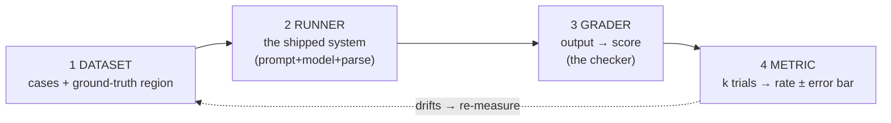

# Evals: How You Measure an LLM That Won't Give the Same Answer Twice

### Success rate, pass@k, pass^k, consistency@k, LLM-as-judge, drift, and compounding — the statistics behind testing AI

An **eval** is a systematic *measurement* of an AI system's behavior. Not a test that
passes or fails — a measurement that returns a *number with an error bar*. That
distinction is the entire subject of this post. In the [last](https://medium.com/@sainitesh/the-9-stages-of-llm-inference-how-your-prompt-becomes-a-token-stream-ef7f9956e6f0)
[two posts](https://medium.com/data-science-collective/how-llm-serving-gets-fast-flashattention-pagedattention-continuous-batching-speculative-cd980096daf2)
I traced how a prompt becomes a token stream and how serving makes it fast — the
machine that *produces* output. Evals answer the question that leaves open: once the
tokens come out, **how do you know they're any good?** The thing that surprised me
learning this is that an eval isn't harder testing, it's a *different category* — a
normal test proves a **property**, an eval measures a **statistic** — and everything
below is that one idea wearing several costumes, grounded in real numbers from a
simulator you can run on a laptop.

## Why evals exist at all

Back in the [9 stages](https://medium.com/@sainitesh/the-9-stages-of-llm-inference-how-your-prompt-becomes-a-token-stream-ef7f9956e6f0),
**stage 6 was decode**: the model emits a probability distribution over the vocabulary
and a sampler picks one token. That's why an eval — not a unit test — is the right tool.
The model never returns *the* answer; it returns a **distribution**, and temperature/top-p
roll the dice. Ask it to extract a name five times:

```
{"name": "Jane Doe"}   {"name": "jane doe"}   {"name": "Jane"}   {"name": "Doe, Jane"}
```

Same input, four outputs, nothing broken. So the reflex —

```python
assert extract_name(email) == '{"name": "Jane Doe"}'
```

— is a lie: you're asserting a property on a random variable. An eval replaces that
`assert` with a *measurement*.

## First, five words

- **Deterministic vs stochastic** — a function gives one output; the system an eval
  measures gives a *sample* from a distribution. `f(x)` vs `P(y|x)`.
- **Golden set** — the eval's dataset: cases plus ground truth, where ground truth is a
  *region* ("confirmed or waitlisted"), not one string — which is why `==` dies.
- **Grader (the checker)** — the part of the eval that turns one output into a
  pass/fail score: exact-match, an automatic checker, a rubric, another LLM, or a human.
- **Success rate & pass@k / pass^k** — the eval's output. Run a case *k* times:
  **pass@k** = did *at least one* of the k runs pass? **pass^k** = did *all* k runs pass?
  Same system, two very different verdicts.
- **Drift** — the frozen system silently changing over time as the provider updates the
  model, so the eval's number moves with no code change.

## Anatomy of an eval: four boxes

Every eval — hand-rolled or in a framework — is the same pipeline:



1. **Dataset** — cases + ground truth. *The fixtures.*
2. **Runner** — the **shipped** system, not the raw model: prompt + model + parsing.
   *An eval grades what you deploy.*
3. **Grader** — output → score. *The checker, and the hard part.*
4. **Metric** — many scores → one rate, with error bars. *The SLI the eval reports.*

The dotted arrow is why an eval isn't a unit test: the number **decays**, so the eval
runs forever.

---

## The core of an eval: what is actually being tested

Everything hinges on one move. Take **one case** from the golden set:

> **Input:** "Table for 4 tomorrow at 7pm under Jane."
> **Ground truth (region):** `status ∈ {confirmed, waitlisted}` and `party_size == 4`

Because the LLM is stochastic (stage-6 sampling), we don't run this **once** — we run the
*same case* **k times**. Each run is an **iteration** (a **trial**; in the Inspect
framework, an **epoch**). Each iteration independently **passes** (output lands in the
region) or **fails**. So *what is being evaluated* = the **distribution of pass/fail**
across k iterations of the same input. A real k=5 run:

```
iteration 1:  PASS   {"status":"confirmed","party_size":4}
iteration 2:  PASS   {"status":"waitlisted","party_size":4}
iteration 3:  FAIL   {"status":"confirmed","party_size":2}   <- wrong party size
iteration 4:  PASS   {"status":"confirmed","party_size":4}
iteration 5:  PASS   {"status":"confirmed","party_size":4}
```

4 of 5 passed. The next three metrics ask **three different questions** about that same
sequence.

### pass@k — "does *at least one* of k tries pass?"

- **Question:** if the system attempts this k times and I keep the *best* one, does it succeed?
- **Rule:** pass if **any** of the k iterations passed. Our run → at least one PASS → **pass@5 = success**.
- **The number, in words:** one try *fails* 10% of the time (since p=0.90). For pass@k to
  fail, **every** try must fail — `0.10 × 0.10 × 0.10 × 0.10 × 0.10` for k=5, which is
  basically zero. So pass@5 ≈ 100%. (If you like the compact form, that's `1 − (1−p)^k`:
  100% minus the tiny chance that everything fails.)
- **When it's right:** the system can **retry** and a cheap automatic checker picks the winner.
  Coding agents: generate 5 patches, run the tests, ship whichever passes — you need
  **one** good one. This is the original meaning from OpenAI's **HumanEval**
  (*Evaluating Large Language Models Trained on Code*, [arXiv:2107.03374](https://arxiv.org/abs/2107.03374)).

### pass^k — "do *all* k tries pass?"

- **Question:** if I run this k times, does **every single one** succeed?
- **Rule:** pass only if **all** k iterations passed. Our run → iteration 3 failed → **pass^5 = fail**.
- **The number, in words:** each try passes 90% of the time, and you need them *all* to
  pass, so multiply: `0.90 × 0.90 × 0.90 × 0.90 × 0.90 = 0.59`. Five 90%-steps in a row is
  only 59%. (Compact form: `p^k`.)
- **When it's right:** the system **can't retry** — every call must be right because there's
  no automatic checker at run time to catch a bad one, or the steps chain. A 20-step agent where one
  silent wrong step corrupts the trajectory lives here.

The key contrast — same 90% system, real simulator output:

```
    k    pass@k (any)    pass^k (all)
    1          90.0%          90.0%
    2          99.0%          81.0%
    3          99.9%          72.9%
    4         100.0%          65.6%
    5         100.0%          59.0%
    8         100.0%          43.0%
```

Same system, same `p`. pass@k rewards you for retrying; pass^k punishes you for
inconsistency. Reporting the wrong one is how a "99% agent" ships and then fails 40% of
the time in production.

### consistency@k — "*how many* of the k passed, and is it stable?"

pass@k and pass^k both collapse k iterations to a single yes/no. **consistency@k keeps
the count** — it measures *reliability*, not best- or worst-case. The trap it catches:
two systems with the **identical mean** and wildly different reliability. Real simulator
output, both systems averaging 80%:

```
    system   mean pass   consistency@k
         A      80.7%          34.0%     <- every case ~80%: flaky everywhere
         B      81.0%          55.8%     <- half cases 100%, half 60%: split-personality
```

- **System A** never fully trusts any single case but has no total blind spots.
- **System B** is rock-solid on most inputs and **completely unreliable** on the rest — a
  landmine field a single mean would hide.

### One case, all three metrics at once

For the k=5 run above:

| Metric | Value | Reads as |
|---|---|---|
| passes / k | 4/5 | raw count |
| **pass@k** | 1 | "best-of-5 works" |
| **pass^k** | 0 | "not reliable enough for no-retry" |
| **consistency** | 0.8 | "80% stable on this case" |

Then you aggregate across all cases to get the suite number. The **iterations (k)** buy
statistical confidence — more iterations, tighter error bars on every metric.

**Summary:**
- **pass@k** = *can it ever?* (any) — optimistic, for retry systems.
- **pass^k** = *can it always?* (all) — pessimistic, for no-retry / chained systems.
- **consistency@k** = *how reliably?* (the spread) — catches equal-mean, unequal-risk systems.

---

## The grading ladder: an eval uses the cheapest checker that's still true

| Rung | Grader | Cost | Trust |
|---|---|---|---|
| 1 | Exact match | ~0 | perfect |
| 2 | Programmatic / automatic checker (does the SQL run? tests pass?) | low | high |
| 3 | Rubric checklist | low–med | medium |
| 4 | **LLM-as-judge** | med | medium, **biased** |
| 5 | Human | high | high, slow |

The cheap rungs are just typed checks over parsed output:

```python
def deterministic_check(out, case):
    if out.status not in case.accepted_status:   # region, not ==
        return False
    return out.party_size == case.expected_party
```

SWE-bench is a rung-2 eval — it grades by *running the repo's real tests* against the
model's patch. LLM-as-judge (rung 4) scales grading to thousands of cases at the price of
judge biases (position, verbosity, self-preference) it must design out — that's Part 2.

## Drift: an eval that catches what no test can

Freeze code and prompt; the provider swaps the model and the hidden rate moves:

```
month  true p   measured   gate(>=90%)
    0    0.93     93.6%     PASS
    3    0.89     88.3%     FAIL  <- regression, empty git log
```

A unit test stays green — nothing to re-run. Only a *scheduled* eval catches it.

## Why the eval matters, in one calculation

Chain steps and reliability **compounds** — end-to-end `= p^n`:

```
steps    1     5     10     20
p=0.90  90%   59%   35%    12%
```

**`0.90^20 ≈ 0.12`.** A "90% component" is a **12% pipeline** at 20 steps, and every
per-step failure is silent (`200 OK`, valid JSON, confidently wrong). Without an eval,
nothing pages you while the agent quietly fails four times in five.

## Eval frameworks: the reference tools

Two open frameworks are the concrete references here — both just the four boxes with
better ergonomics:

- **DeepEval** — evals as *pytest*: a case is an `LLMTestCase`, a grader is a `Metric`
  (incl. `GEval`, an LLM-judge in plain English). Best for CI.
- **Inspect** (UK AI Security Institute) — evals as `Task(dataset, solver, scorer)`, with
  `epochs=k` making pass@k first-class. Best for rigorous, agentic evals.

The landscape splits four ways: **eval libraries** (Inspect, DeepEval, OpenAI Evals,
lm-eval-harness, RAGAS, promptfoo) = CI; **eval+observability platforms** (LangSmith,
Langfuse, Arize Phoenix, Braintrust, W&B Weave) = production monitoring; **benchmarks**
(SWE-bench, τ-bench, WebArena, GAIA) = standardized eval exams; **guardrails**
(Llama Guard, NeMo Guardrails, OpenAI moderation) = the safety gate.

## See the eval run

No API key. One file, `eval_intuition_simulator.py`, models a case as a coin and prints
every number above:

```bash
python3 eval_intuition_simulator.py --demo passk        # pass@k vs pass^k
python3 eval_intuition_simulator.py --demo consistency  # equal mean, different spread
python3 eval_intuition_simulator.py --demo compound     # 0.9^20 -> 12%
python3 eval_intuition_simulator.py --demo drift         # frozen eval goes red
```

The same repo has the *real* eval — a reservation agent graded end-to-end in DeepEval and
Inspect.

## The mental model

An eval exists because an LLM call is a **random variable, not a function**, so correctness
is a **statistic, not a property**. You don't prove it once — the eval *samples* N times,
scores *meaning* not form, aggregates to a rate with error bars, and re-runs forever
because it drifts. The N=1 lie, pass@k vs pass^k, consistency, the grading ladder, the
biased judge, and drift are the same fact — an eval is SRE for a stochastic process.

Next: **Part 2 — the eval's grader in depth**, and building an LLM-as-judge a flaky model
can't fool.

## References

- **Previous posts** — [The 9 Stages of LLM Inference](https://medium.com/@sainitesh/the-9-stages-of-llm-inference-how-your-prompt-becomes-a-token-stream-ef7f9956e6f0)
  · [How LLM Serving Gets Fast](https://medium.com/data-science-collective/how-llm-serving-gets-fast-flashattention-pagedattention-continuous-batching-speculative-cd980096daf2)
- **pass@k origin (HumanEval)** — Chen et al., 2021: [arXiv:2107.03374](https://arxiv.org/abs/2107.03374)
- **Inspect** — [github.com/UKGovernmentBEIS/inspect_ai](https://github.com/UKGovernmentBEIS/inspect_ai)
- **DeepEval** — [github.com/confident-ai/deepeval](https://github.com/confident-ai/deepeval)
- **SWE-bench** — [github.com/SWE-bench/SWE-bench](https://github.com/SWE-bench/SWE-bench)
- **Model drift study** — Chen, Zaharia, Zou, 2023: [arXiv:2307.09009](https://arxiv.org/abs/2307.09009)
