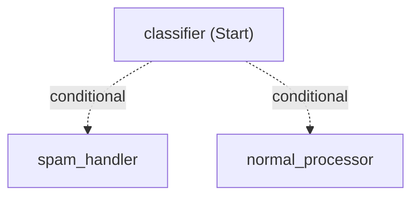

# Conditional Routing

```mermaid
flowchart TD
  classifier["classifier (Start)"];
  spam_handler["spam_handler"];
  normal_processor["normal_processor"];
  classifier -. conditional .-> spam_handler;
  classifier -. conditional .-> normal_processor;
```
